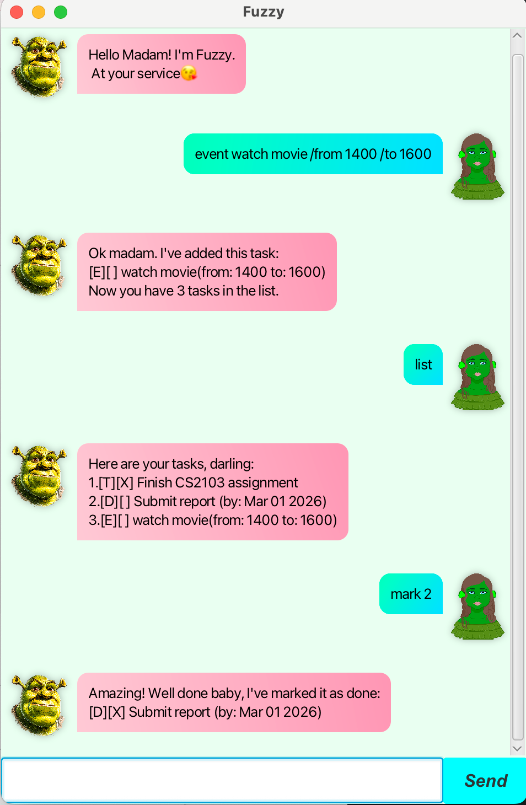

# Fuzzy User Guide

Welcome to **Fuzzy**!
Fuzzy is a friendly task manager chatbot that helps you manage your daily tasks through a simple chat interface.

You can add todos, deadlines, and events, mark tasks as done, unmark them, remove tasks, and view your task list — all using easy text commands.

---

## Product Screenshot



---

## Getting Started

1. Launch the application.
2. Type your command in the input box.
3. Click **Send**.
4. Fuzzy will respond and update your task list automatically.

All changes are saved automatically.

---

## Features

### Add a ToDo

Adds a simple task without a date.

**Command**

```
todo DESCRIPTION
```

**Example**

```
todo Finish CS2103 assignment
```

**Result**
The task is added to your list.

---

### Add a Deadline

Adds a task with a due date.

**Command**

```
deadline DESCRIPTION /by YYYY-MM-DD
```

**Example**

```
deadline Submit report /by 2026-03-01
```

**Result**
The deadline task is added and displayed with its due date.

---

### Add an Event

Adds a task with a start and end time.

**Command**

```
event DESCRIPTION /from HHMM /to HHMM
```

**Example**

```
event Team meeting /from 1400 /to 1600
```

**Result**
The event is added to your list.

---

### List Tasks

Displays all tasks currently stored.

**Command**

```
list
```

**Result**
All tasks are shown with their status.

---

### Mark a Task as Done

Marks a task as completed.

**Command**

```
mark INDEX
```

**Example**

```
mark 2
```

**Result**
The selected task is marked as done.

---

### Unmark a Task

Marks a completed task as not done.

**Command**

```
unmark INDEX
```

**Example**

```
unmark 2
```

**Result**
The selected task is marked as not done.

---

### Remove a Task

Deletes a task from the list.

**Command**

```
remove INDEX
```

**Example**

```
remove 1
```

**Result**
The task is removed from the list.

---

## Error Handling

Fuzzy handles common user mistakes gracefully, such as:

* Missing descriptions
* Invalid task numbers
* Incorrect command formats

Helpful error messages will be shown to guide the user.


Fuzzy will also detect and prevent events that clash with existing events.

---

## Saving and Loading

All tasks are automatically saved after every change.
When the application is restarted, your tasks will be loaded from the saved file.

---

## Command Summary

| Action       | Command                                 |
| ------------ | --------------------------------------- |
| Add todo     | `todo DESCRIPTION`                      |
| Add deadline | `deadline DESCRIPTION /by DATE`         |
| Add event    | `event DESCRIPTION /from START /to END` |
| List tasks   | `list`                                  |
| Mark task    | `mark INDEX`                            |
| Unmark task  | `unmark INDEX`                          |
| Remove task  | `remove INDEX`                          |

---

Enjoy staying organized with **Fuzzy**!
